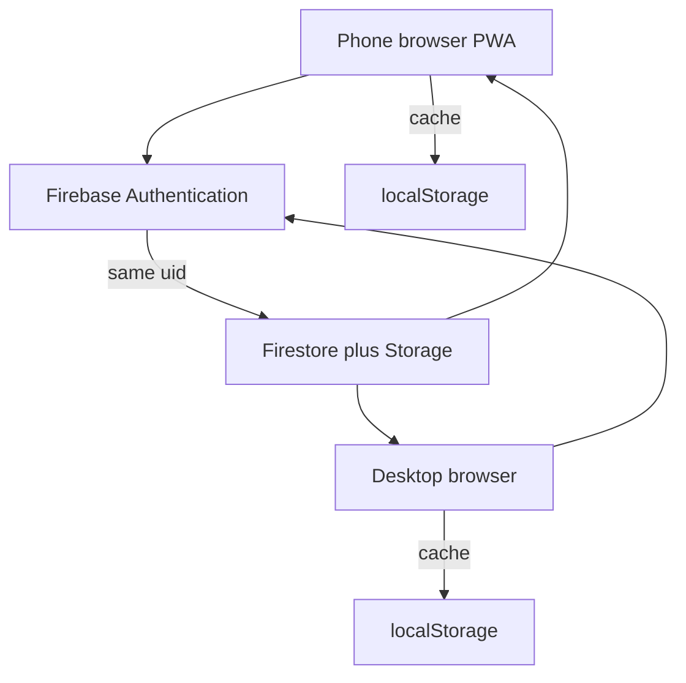
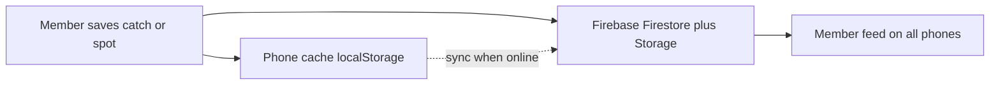
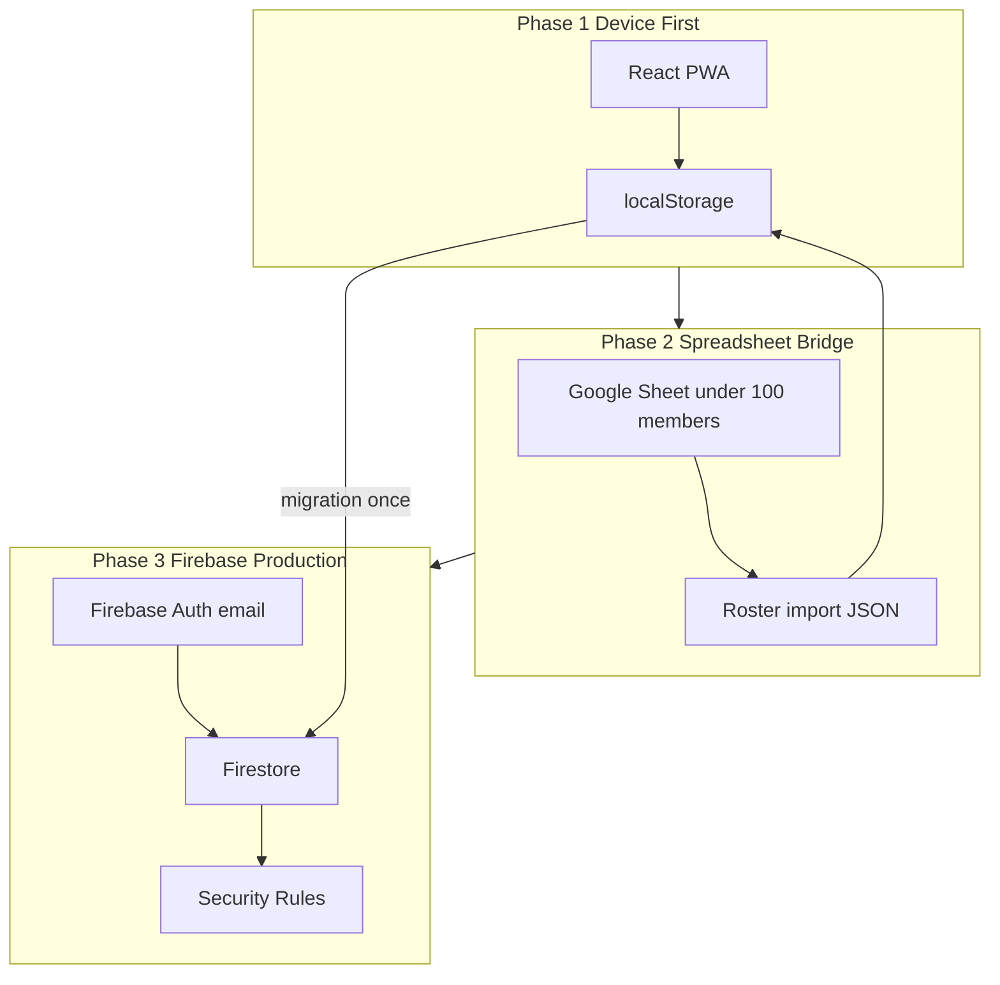

# RFC Fishing App — Master Plan

**Product north star (Jobs):** A fisherman opens the app, learns what to use without Googling, logs a catch in under a minute, and optionally shares a spot with the club or a friend — without feeling like a pro.

**Engineering north star (Woz):** One React PWA, one source file for app logic today (`src/App.jsx`), device-first storage that upgrades in place — local → spreadsheet roster → Firebase — without throwing away the data model.

**Your decisions locked in:**
- Gap 1 jargon work: **approved** — keep nav label **Tackle** (do not rename).
- Gap 2 unknown species: **approved**
- Gap 3 catch flow simplification: **approved**
- Gap 4 Scout tab: **build full feature** per [`docs/RFC-AUDIT.md`](RFC-AUDIT.md) (not placeholder)
- Gap 5 content/trust: **approved**
- Members: **not imported yet** — phased rollout below
- Vertical Westcott ruler bug: **P0 fix** before new features
- **Cloud storage (required end state):** Every user input — catch log, private spots, profile, scout results, sharing choices — must be saved to **RFC cloud (Firebase)**, not only the phone.
- **Member feed (future):** Club-wide feed of catches (and optionally shared spots) read from cloud; replaces today’s fake local “Community Feed.”
- **Member directory:** After roster upload, every signed-in member can **see all club members** (name list from roster / Firebase).
- **Public catch logs:** Members can **see every other member’s public (club-feed) catches** — not private logs. Requires cloud + auth.
- **Same account on phone and browser:** Sign in once with a real account; profile, catches, and spots follow the user — not trapped in phone-only storage.
- **User database + modern sign-in:** Firebase Auth with user ID, email/password, Google (Gmail), phone SMS, Facebook (and Apple optional on iPhone).
- **Roster gate (locked):** Only people on the **uploaded member list** may sign in and use the app. Everyone else is **blocked** (no guest mode for now).
- **Firebase project (shared):** `rfc-management` — same as [`Desktop/RFC/Firebase`](../Firebase). Member doc ID `adam_bielawski` (not RFC-001).
- **First seed member:** Example admin row — `admin@example.com`, phone `(555) 555-0100`. Password set in Firebase Auth only (never stored in repo or docs).

---

## Where data lives — plain answer

| Storage | What it is | User catch / spot data? |
|---------|------------|-------------------------|
| **Phone (localStorage)** | Temporary cache while building the app | **Yes, today only** — **separate per browser/device** (phone app ≠ desktop browser) |
| **GitHub / Cloudflare Pages** | Hosts the app (HTML/JS/CSS) | **No** — never stores member data |
| **Firebase (RFC cloud)** | Database + file storage for the club | **Yes, target** — all inputs sync here; other members can see shared items |

**Today:** Saving on your **phone** writes to that phone’s browser storage only. Opening the **same app in a desktop web browser** is a different storage bucket — **your data will not appear.** That is expected until Phase 3 sign-in + cloud sync.

**Target:** Sign in with **one account** (email, Google, phone, etc.) → same catches, spots, and profile on **phone, tablet, and browser**.

---

## Why phone data does not show in the browser (today)

The app has **no login and no server database.** It uses `localStorage`, which is:

- Tied to **one browser on one device** (phone Safari ≠ Chrome on laptop)
- **Not synced** to GitHub, Cloudflare, or Firebase
- Cleared if you clear site data

**Fix (Phase 3):** Firebase **Authentication** + **Firestore**. User signs in → app loads `members/{uid}`, `catches`, `private_spots` from cloud → phone and browser show the same account.

---

## User database and sign-in (Phase 3)

**Product rule:** No RFC member features (feed, shared spots, cloud backup) without signing in. Profile name/email fields today are local-only labels until auth exists.

### Recommended stack: Firebase Authentication + Firestore

Firebase is already in your roadmap; it supports the sign-in methods you asked for without building a custom password server.

| Sign-in method | Use case | Firebase provider |
|----------------|----------|-------------------|
| **Email + password** | RFC members who prefer traditional login | Email/Password |
| **Google (Gmail)** | One-tap sign-in for Gmail users | Google |
| **Phone number** | SMS code login on mobile | Phone |
| **Facebook** | Social login | Facebook |
| **Apple** | Optional; good for iPhone App Store rules later | Apple |

**Enable in Firebase Console** → Authentication → Sign-in method (each provider needs one-time setup; Facebook/Google need app IDs).

### User record shape

**Firebase Auth** (built-in — do not store passwords in Firestore):

| Field | Source |
|-------|--------|
| `uid` | Firebase user ID (primary key everywhere) |
| `email` | Auth provider |
| `phoneNumber` | If phone sign-in |
| `providerIds[]` | google.com, facebook.com, password, phone |

**Club access check (locked):** On sign-in, normalize email to lowercase and match `auth.email` to `club_roster` row with `active: true`. **If not on roster → sign-in rejected** with message: *"Not an RFC member — contact the club admin."* No feed, no cloud writes, no app use beyond a blocked sign-in screen.

### Member roster schema (Phase 2 sheet → Phase 3 Firestore `club_roster/{memberId}`)

| Field | Rules |
|-------|--------|
| `memberId` | Unique stable ID, e.g. `RFC-001`, `RFC-002` (never reuse) |
| `firstName` | Required; trimmed; title case on display |
| `lastName` | Required; trimmed; title case on display |
| `email` | Required; **lowercase** after trim; valid format; **unique** across roster |
| `phone` | Digits only in storage (`5555550100`); display as `(555) 555-0100` |
| `active` | `true` / `false` — inactive cannot sign in |
| `role` | `member` \| `admin` (admin can refresh roster later) |
| `createdAt` | ISO timestamp |
| `authUid` | Filled after first successful sign-in (links roster row → Firebase Auth `uid`) |

**Import validation (app + future admin script):**
- Reject row if email invalid, duplicate email, missing first/last name, or duplicate `memberId`
- Sanitize: trim all strings; email → lowercase; phone → digits only

**First seed row (no password in file):**

| memberId | firstName | lastName | email | phone | active | role |
|----------|-----------|----------|-------|-------|--------|------|
| RFC-001 | Adam | Bielawski | admin@example.com | 5555550100 | true | admin |

Password for Adam: create **once** in Firebase Console or Admin SDK at Phase 3 setup — **never commit password to GitHub, docs, or seed JSON.** Minimum length **10 characters** (your chosen password meets this). **Do not use MD5** for passwords — Firebase Auth uses **scrypt** (industry standard; stronger than MD5).

### Password and auth storage

| What | Where | Notes |
|------|--------|------|
| Password hash | **Firebase Auth only** | Never in Firestore, CSV, or client code |
| Plain password | **Nowhere in repo** | Set via Firebase Console / one-time admin script locally |
| OAuth tokens | Provider (Google/Facebook) | App only needs public client IDs in config |

**Recommendations added:**
- Link roster `memberId` to Auth `uid` on first login (`authUid` field)
- Require email verification before club features (Firebase setting)
- After sharing password in chat, **change it** before production deploy
- Rate-limit failed sign-ins (Firebase default)

### Future OAuth providers — API config placeholder (develop later)

Social login (Google, Facebook, Apple, phone SMS) needs provider apps and IDs. Add a **checked-in template** with empty fields — fill in Firebase Console + env when ready:

**New file (Phase 3 setup):** [`src/config/authProviders.example.js`](src/config/authProviders.example.js)

```javascript
// Copy to authProviders.local.js (gitignored) or use .env — never commit secrets
export const AUTH_PROVIDER_CONFIG = {
  emailPassword: { enabled: true },
  google: { clientId: "", enabled: false },
  facebook: { appId: "", enabled: false }, // app secret stays server-side only, future
  apple: { clientId: "", enabled: false },
  phone: { enabled: false }, // Firebase Phone Auth; SMS billing in Console
};
```

**Also:** `.env.example` with blank `VITE_FIREBASE_*` keys and comment block listing each OAuth provider setup URL. Real values in `.env.local` (gitignored).

**Firestore `members/{uid}`** (RFC profile — your app data):

```javascript
{
  uid,                    // same as Auth uid
  memberId,               // RFC-001 — from roster
  rosterMemberId,         // alias; same as memberId
  firstName,
  lastName,
  displayName,            // "Adam Bielawski" — derived first + last
  email,                  // lowercase copy for display/queries
  phone,                  // digits only
  level,                  // Beginner / Intermediate / Experienced
  gear, favSpecies,
  createdAt, updatedAt,
  lastLoginAt
}
```

**Removed:** duplicate `Club access check` paragraph below — see locked rule above.

### Sign-in UI (Profile / first launch)

- **“Sign in to save catches everywhere”** — explain phone + browser sync
- Buttons: **Continue with Google** | **Facebook** | **Phone** | **Email**
- After sign-in: merge local `localStorage` data into cloud (one-time migration prompt)
- **Sign out** clears local cache but cloud data remains

### Security notes (non-negotiable)

- Passwords handled **only by Firebase Auth** — never store plain passwords in Firestore or GitHub
- Firestore rules: users read/write **their own** `members/{uid}`; catches/spots scoped by `ownerId == request.auth.uid`
- API keys in app are **public Firebase config**; security is **rules + Auth**, not hiding keys



---

## Members + public catch logs (your requirement)

**What you want:** Upload members → each member opens the app → sees **who is in the club** → sees **everyone’s public catch logs** (not private ones).

**What each phase delivers:**

| Phase | See all members? | See others’ public catches? |
|-------|------------------|-----------------------------|
| **1 — Phone only** | No (demo roster only) | No (fake local feed only) |
| **2 — Roster upload** | **Yes** — list from spreadsheet on each phone | **No** — catches still on each phone only |
| **3 — Firebase** | **Yes** — roster + profiles in cloud | **Yes** — feed queries cloud |

**Spreadsheet alone cannot show other people’s catches.** It only supplies names for pickers until Firebase is live.

### Member directory (after roster upload)

- **Catch tab** or **Profile** → **Club members** — searchable list: display name, optional avatar initial
- Data source Phase 2: imported sheet cached in `rfc_club_roster_v1`
- Data source Phase 3: Firestore `members` + `club_roster`, synced with sheet
- Tap a member (Phase 3b): **Public catches** sub-view — only catches where `visibility` is `club` or `public_feed`

### Public catch log rules

| Visibility | Who sees it |
|------------|-------------|
| **Private** | Owner only |
| **Club** (public to club) | All uploaded / active members |
| **Specific members** | Named members only |
| **public_feed** | Same as club for v1; optional later: highlight on main feed |

**At log time (Catch review step):** Add clear choice — *“Keep private”* vs *“Share with club (show on member feed)”* — default **private** until member opts in.

**Member feed (Catch tab):** Replace demo data with Firestore query:

```
catches where visibility in ['club', 'public_feed']
  order by created_at desc
  limit 50
```

Join `ownerId` → member display name from `members/{uid}`.

**Every catch save (Phase 3):** Write to Firestore + Storage first; then update local cache. Private catches still saved to cloud (owner-only rules) so nothing is lost if phone dies.

---

## Product requirement — cloud backup + member feed

**Everything that gets typed, photographed, or GPS-tagged should eventually land in RFC cloud:**

| User action | Local now | Cloud later (Firebase) |
|-------------|-----------|-------------------------|
| Log a catch (photo, species, length, bait, spot) | `rfc_catches_v1` | `catches/{id}` + photo in Storage |
| Save private spot | `profile.privateSpots` | `private_spots/{id}` |
| Profile (name, email, gear, favorites) | `rfc_fishing_profile_v2` | `members/{uid}` |
| Scout identify result | (planned local) | `scout_history/{id}` or subcollection |
| Share with club / member | local flags only | same doc + `visibility` + rules |
| Location trail (device assist) | `rfc_location_trail_v1` | optional; can stay local-only |

**Member feed (future feature):**

- **Source:** Firestore query — catches where `visibility` is `club` or `public_feed`, ordered by `created_at` desc.
- **UI:** Replace Catch tab “Community Feed” demo list with live feed; show angler name, species, length, photo thumb, spot, date.
- **Privacy:** Default new catch to **private** or **club** (your choice at log time); never publish without explicit visibility.
- **Phase:** Build feed UI after Firebase write path works (Phase 3b), not before cloud exists.



**Phase 1 is a bridge, not the destination.** Local storage stays for offline/PWA, but the plan treats **cloud as required** before calling sharing or feed “done.”

---

## Current state (what already works)

| Area | Today | Limit |
|------|--------|--------|
| Profile | `localStorage` key `rfc_fishing_profile_v2` | One device only |
| Private spots | Same profile blob; `shareClub` + `sharedWith[]` UI | Sharing is **local simulation** — other members do not see your pins |
| Catches | `localStorage` key `rfc_catches_v1` | Feed is device-local mock + demo entries |
| Location trail | `rfc_location_trail_v1` | Device only |
| Club roster | Hardcoded `CLUB_ROSTER` (4 demo names) | Not your real spreadsheet |
| Scout | Placeholder `ScoutTab` | Not built |
| Firebase | Not in repo | Spreadsheet exists off-app; Firebase ready when you are |

**Important:** Private spot sharing UI already matches your Facebook-style intent (`Private` → `Share with Club` → `Share with specific members`). What is missing is **sync** so other people actually receive shared data.

---

## Data architecture — three phases



### Phase 1 — Local only (now → app stable)

**Goal:** Every feature works offline on the phone; data survives refresh; schema is Firebase-ready.

**Storage keys (standardize in one module later):**

| Key | Content |
|-----|---------|
| `rfc_fishing_profile_v2` | name, email, level, gear, favSpecies, privateSpots, spotActivityLog, memberId |
| `rfc_catches_v1` | array of catch entries with photo data URLs |
| `rfc_location_trail_v1` | GPS trail for manual spot entry |
| `rfc_scout_history_v1` | **new** — last N spot-ID attempts (photo thumb, result JSON, date) |
| `rfc_sync_meta_v1` | **new** — `{ schemaVersion, lastExportAt }` for future migration |

**Unified data shapes (design now, use in Phase 1):**

```javascript
// Private spot (already close to this in App.jsx)
{
  id, member_id, name, lat, lng, notes, species_present, access_info,
  shareClub: boolean,           // visible to all club members
  sharedWith: [{ id, name }],   // visible only to these members
  visibility: "private" | "club" | "members",  // derived; store for Firebase
  created_at, updated_at
}

// Catch (extend current)
{
  id, member_id, species, length, bait, spot, rod, notes, date, photo,
  visibility: "private" | "club" | "members" | "public_feed",
  sharedWith: [{ id, name }],
  created_at
}
```

**Sharing UX (Facebook-style — extend existing Spots UI):**

1. **Only me** — default; stays on device (Phase 1) / only owner reads (Phase 3)
2. **Club** — all members who are in the roster can see pin on club map
3. **Specific members** — checkbox list from roster (already in spot detail)
4. **Future:** catch log sharing uses same control on review screen

Phase 1 behavior: toggling share updates local profile + club map section (your pins + `MOCK_CLUB_SHARED_SPOTS`). Show honest label: *"Saved on this device — club sync when online roster is connected."*

**Deliverables:**
- P0: Fix vertical Westcott ruler overlay
- Gaps 1–3 beginner UX (see below)
- Extract storage helpers to `src/services/localStore.js` (optional small file — reduces App.jsx risk)
- Export backup: Profile → *Download my data* (JSON file) for peace of mind

---

### Phase 2 — Spreadsheet roster bridge (under 100 members)

**Goal:** Real member names for sharing pickers; no Firebase yet; admin-controlled roster.

**Spreadsheet columns (Phase 2 — matches seed schema):**

| memberId | firstName | lastName | email | phone | active | role |
|----------|-----------|----------|-------|-------|--------|------|

**How it connects (Woz-simple):**
- Admin exports sheet as **CSV or JSON** (or published Google Sheet CSV URL)
- App: Profile → *Refresh club roster* → fetches CSV → replaces `CLUB_ROSTER` in memory + caches to `localStorage` key `rfc_club_roster_v1`
- User profile `memberId` matches spreadsheet `memberId` (auto-link on first sign-in by lowercase email match)
- Sharing `sharedWith[].id` uses real `memberId` values — ready for Firebase
- Ship seed file [`data/seeds/club-roster-v1.json`](data/seeds/club-roster-v1.json) with Adam row only (no passwords)

**What still does NOT sync in Phase 2:**
- Other users still do not see your shared spots on their phones (no server)
- Optional: *Share via email* button exports spot JSON + maps link (human bridge)

**Deliverables:**
- Roster import UI + parser (sanitize all fields)
- Replace hardcoded `CLUB_ROSTER` with imported roster + fallback demo list
- **Club members screen** — list all uploaded members (read-only directory)
- Document sheet format in `docs/roster-format.md`

**Still requires Phase 3 for:** other members’ catch logs on your phone.

---

### Phase 3 — Firebase cloud + authentication (**required**)

**Goal:** All user input saved to cloud; **same account on phone and browser**; shared data visible to chosen members; foundation for member feed.

**Step 3a — Auth (before feed):**
1. Add Firebase project + `.env.example` (blank keys) + `authProviders.example.js` (blank OAuth fields)
2. Import seed roster to Firestore `club_roster`; create Adam’s Auth account via Console (password not in repo)
3. Enable Email/Password first; leave Google/Facebook/Phone **disabled** until API IDs filled in
4. Profile tab: sign-in / sign-out UI; **block non-roster emails**
5. Gate cloud writes behind `request.auth.uid` + roster `active` check
6. On first sign-in: offer **“Upload my data from this device”** (merge localStorage → Firestore)

**Step 3b — Data sync:**

**Write path (every save):**
1. User submits catch / spot / profile change
2. App writes to **Firestore** (and **Storage** for photos) immediately when online
3. App updates **localStorage** as offline cache
4. If offline, queue in `rfc_sync_outbox_v1` and flush when back online

**Recommended Firebase layout:**

| Collection | Document | Notes |
|------------|----------|--------|
| `members/{uid}` | profile fields | Auth uid = key; email verified |
| `private_spots/{spotId}` | spot fields + `ownerId`, `visibility`, `sharedWithIds[]` | |
| `catches/{catchId}` | catch fields + `ownerId`, `visibility`, `sharedWithIds[]` | photos in Storage |
| `scout_results/{id}` | optional history | per member |
| `club_roster/{memberId}` | read-only mirror of sheet | Phase 2 sheet → Firestore |
| `feed_items/{id}` | **optional denormalized** | or query `catches` directly for feed |

**Security rules (concept):**

```
// Catch or spot readable if owner OR shareClub OR sharedWith contains viewer
allow read: if request.auth.uid == resource.data.ownerId
         || (resource.data.visibility == "club" && isClubMember())
         || request.auth.uid in resource.data.sharedWithIds
         || resource.data.visibility == "public_feed";
allow write: if request.auth.uid == resource.data.ownerId;
```

**Migration path:**
1. User signs in with email (Firebase Auth — match profile email to roster)
2. One-time upload: local catches, privateSpots, profile
3. Phone keeps localStorage as offline cache (PWA)

**Photos:** Firebase Storage path `catches/{uid}/{catchId}.jpg`; Firestore holds URL + metadata only.

### Phase 3b — Member feed + member public logs

**Goal:** Real club feed; any member can browse **all members** and **public catches**.

**Catch tab — two views:**
1. **Feed** — all club/public catches from all members (newest first)
2. **My logs** — your catches (all visibility levels)

**Club members screen:**
- List every active member from roster
- Tap member → **Public catches** only (Firestore filter by `ownerId` + visibility)

**On post (step 6):** If visibility is club/public, show: *“Posted to member feed — all club members can see this.”*

**Auth gate:** Must sign in with email that matches roster before seeing feed or directory (prevents random visitors from reading club data).

---

## P0 — Bug fix: vertical Westcott ruler

**File:** [`src/App.jsx`](src/App.jsx) CatchTab step 2

**Fix:**
1. Two layers: ruler strip on right (full photo height) + mouth/tail markers on full photo (`inset: 0`)
2. Size rotated PNG so 20 inches = container height (not 52px overflow smear)
3. Help text: horizontal = "full width", vertical = "full height"

---

## Gap 1 — Jargon (approved; keep Tackle label)

| Priority | Item | Status |
|----------|------|--------|
| P1 | Link Species rig names → Tackle (`CATALOGUE`) detail | Planned |
| P1 | One-line plain summary on rig cards | Planned |
| P2 | Tap-to-define glossary (`?` on slip float, spawn sac, etc.) | Planned |
| ~~P2~~ | ~~Rename Tackle nav~~ | **Cancelled — keep Tackle** |

---

## Gap 2 — Unknown species (approved)

| Priority | Item |
|----------|------|
| P1 | "Not in list? Enter fish name" on Catch step 3 |
| P1 | AI unknown-fish card: save as-is or pick closest match |
| P1 | `SPECIES_ALIASES` (dogfish → Bowfin, mudfish → Bowfin) |
| P2 | Keeper/release stub + IDNR link on review |

---

## Gap 3 — Catch flow for non-pros (approved)

| Priority | Item |
|----------|------|
| P1 | Default measurement UI only; hide methods 2–6 behind accordion |
| P1 | Bait suggestion chips from species on Catch Details |
| P2 | Profile `level === Beginner"` sorts Species grid, Home callout |
| P2 | First-run 3-step hint on Catch tab |

---

## Gap 4 — Scout tab (full build per RFC-AUDIT)

**Replace** placeholder [`ScoutTab`](src/App.jsx) with two sections.

### Section A — Identify This Spot

- Header + subtitle per audit
- Upload photo (`accept="image/*"`)
- Loading: "Analyzing location..."
- Anthropic API (same pattern as CatchTab) with audit JSON prompt
- Result card: confidence badge (green >70%, gold 50–70%, red <50%), location, water type pill, species chips, reasoning, bait1/bait2, Maps buttons via `mapsUrl(lat,lng)`
- Fallback orange card when `cannotIdentify: true`
- Save result to `rfc_scout_history_v1` (Phase 1 local)

### Section B — Fishable Water Near You

- GPS on tab open (permission prompt copy for beginners)
- New constant `SCOUT_SPOTS` — 25+ entries from audit (DPR, Salt Creek, Cal-Sag, Palos, Lake Michigan)
- Distance: use existing `haversineMi()` (more accurate than audit’s rough formula)
- Filter within **10 miles** (audit build spec); show empty state if none
- Sort nearest first
- Card: name, water type pill, distance, parking, species chips (max 4), tip, alert, Maps buttons
- Optional bite hint: simple label from species count + season (audit checklist mentions bite score — lightweight version)

### Scout + sharing (Phase 1)

- "Save to My Private Spots" button on Scout result → pre-fills Spots save flow with lat/lng/name
- No cross-user sync until Phase 3

---

## Gap 5 — Content and trust (approved)

- Species detail: 3-point "compare to your catch" checklist
- Catch review: show license/health alerts when species matches `SPECIES[].alert`
- Home: "New to fishing? Start here" → Learn → Gear for Beginners
- Tackle offline: text-first if image load fails

---

## Recommended build order (one PR-sized step at a time)

| Step | Work | Phase |
|------|------|-------|
| 0 | Vertical Westcott ruler fix | 1 |
| 1 | Unknown species + aliases | 1 |
| 2 | Rig → Tackle links + glossary | 1 |
| 3 | Catch beginner mode + bait chips | 1 |
| 4 | Scout tab Section B (GPS + SCOUT_SPOTS) | 1 |
| 5 | Scout tab Section A (photo AI identify) | 1 |
| 6 | Scout history local + "Save to My Spots" | 1 |
| 7 | Sharing honesty labels + export my data JSON | 1 |
| 8 | Spreadsheet roster import + seed `RFC-001` Adam + **Club members directory** + `docs/roster-format.md` | 2 |
| 9 | **Firebase Auth** — Email first; roster gate; config placeholders for Google/Facebook/Phone; Adam test account | 3 |
| 10 | **Cloud save every input** — catches (all visibility), spots, profile; merge localStorage on first sign-in | 3 |
| 11 | Catch review: **private vs share with club** toggle | 3 |
| 12 | **Member feed** + per-member public catch list | 3b |
| 13 | Home BFR / solunar (RFC-AUDIT Step 5) | optional |

After each step: `npm run build`, manual test on phone, git commit, your OK before next step.

---

## What we deliberately defer

- Importing full member list until Phase 2
- Firebase until Phase 3 and app stable (Auth + Firestore — not optional for cross-device sync)
- Real-time club feed sync until Firebase
- Refactoring all of App.jsx into many files (only when a step needs it)
- Renaming Tackle nav

---

## Files touched (by phase)

**Phase 1:** [`src/App.jsx`](src/App.jsx), [`public/ruler-20-inches.png`](../public/ruler-20-inches.png), optional `src/services/localStore.js`

**Phase 2:** `src/services/rosterImport.js`, `docs/roster-format.md`, Profile tab UI

**Phase 3:** `firebase.json`, Firestore rules, `src/services/firebaseSync.js`, Storage rules for catch photos

---

## Success criteria (you’ll know it’s working)

**Beginner:** Opens Bass → taps Ned Rig → reads plain English without leaving app. Logs a dogfish → saves as Bowfin or custom name. Scout → finds water within 10 miles with directions.

**Sharing (Phase 1):** Sets spot to "Share with Club" → sees it on club map on same device with clear "local only" label.

**Sharing (Phase 3):** Jim shares spot with Sarah only → Sarah sees pin on her phone; club share → all members see it on map and feed (if catch visibility allows).

**Cloud:** Every catch log and spot save is stored in **Firebase**, not GitHub or Cloudflare. Phone holds a copy for offline; cloud is the source of truth for the member feed.

---

*Last updated: reflects user review of Gap 1–5, Scout build spec, and three-phase data plan.*
