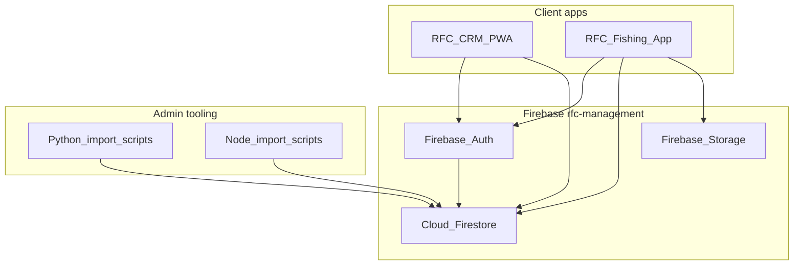

# Riverside Fishing Club — Platform PRD
## Product Requirements Document v1.0

### Document hierarchy

* **Platform PRD (this file):** How the CRM and Fishing App work together on shared Firebase (`rfc-management`).
* **CRM short PRD:** `../Firebase/docs/PRD.md` — admin app quick reference.
* **CRM full spec:** `../Firebase/docs/RFC_CRM_PRD.md` — roster, meetings, import scripts, field lists.
* **Fishing App master plan:** [RFC-MASTER-PLAN.md](./RFC-MASTER-PLAN.md) — engineering phases, gaps, build order.
* **Firebase deploy (rules):** [FIREBASE-DEPLOY.md](./FIREBASE-DEPLOY.md) — security rules and storage deploy steps.

---

### 1. Vision and scope

**North star:** One club, one member roster, two apps — the **CRM** for admins (dues, meetings, guests) and the **Fishing App** for members (catches, spots, club feed).

| In scope | Out of scope |
|----------|--------------|
| Shared Firebase Auth and `members` collection | Merging both repos into one codebase |
| Fishing subcollections on member docs | Public/guest access to Fishing App (roster gate stays locked) |
| Admin CSV import scripts (Firebase repo) | Custom password server (Firebase Auth only) |
| Firestore + Storage rules (fishing-app repo) | Third-party analytics or ad tracking |
| Split deployment (GitHub Pages + Firebase Hosting) | |

---

### 2. Applications

#### A. RFC CRM (`RFC-Firebase` repo)

| Item | Detail |
|------|--------|
| Purpose | Admin PWA + import tooling for roster, dues, attendance, guests, meetings |
| Frontend | React (Vite), PWA |
| Hosting | Firebase Hosting → `build/` |
| GitHub | `https://github.com/ew3adam/RFC-Firebase` |
| Owns | Writes to `members`, `attendees`, `meetingGuests`, `meetings`, membership history |

#### B. RFC Fishing App (`fishing-app` repo)

| Item | Detail |
|------|--------|
| Purpose | Member-facing app — log catches, scout spots, club feed, profile |
| Frontend | React 18 + Vite 5 |
| Hosting | GitHub Pages at `/fishing-app/` |
| Owns | `members/{id}/fishingProfile`, `members/{id}/fishingCatches`, catch photos in Storage |
| Reads | CRM `members` roster for sign-in gate and club directory |

#### 2.1 Tech stack summary

This file is the **map**, not the full stack list. Details live in each app’s doc.

| Layer | Shared (platform) | RFC CRM | RFC Fishing App |
|-------|-------------------|---------|-----------------|
| Frontend | — | React (Vite), PWA | React 18 + Vite 5, PWA |
| Backend / DB | Firebase `rfc-management` — Auth, Firestore, Storage | Same project | Same project |
| Maps / media | — | — | Leaflet, exifr (photo GPS) |
| Admin tooling | — | Python + Node import scripts | — |
| Hosting | Split by app | Firebase Hosting (`build/`) | GitHub Pages (`/fishing-app/`) |
| Security rules | Deployed from **fishing-app** | — | `firebase/firestore.rules`, `storage.rules` |

**Full stack (per app):**

* **CRM:** [Firebase/docs/PRD.md §2](../../Firebase/docs/PRD.md) and [RFC_CRM_PRD.md §2](../../Firebase/docs/RFC_CRM_PRD.md)
* **Fishing App:** [CLAUDE.md § Tech Stack](../CLAUDE.md)

**Shared deploy:** [FIREBASE-DEPLOY.md](./FIREBASE-DEPLOY.md) (rules + storage only).

---

### 3. Shared infrastructure

**Firebase project:** `rfc-management` (same in both repos' `.firebaserc` and `src/lib/firebase.js`).

| Layer | Source of truth | Notes |
|-------|-----------------|-------|
| Auth | Firebase Console | Email/password + OAuth providers as enabled |
| Firestore + Storage rules | `fishing-app/firebase/` | Deploy per [FIREBASE-DEPLOY.md](./FIREBASE-DEPLOY.md) |
| Roster + meeting data | Firebase repo scripts | Service account JSON (gitignored) at CRM project root |
| Public web config | `src/lib/firebase.js` | `VITE_FIREBASE_*` env overrides; security is rules + Auth |

---

### 4. Unified data model

**Member document ID:** `firstname_lastname` (lowercase, underscores), e.g. `adam_bielawski`.

| Firestore path | Owner | Purpose |
|----------------|-------|---------|
| `members/{id}` | CRM imports; Fishing App may update `authUid`, `lastFishingAppLoginAt` only | Roster, contact, `isActive`, dues-related fields |
| `members/{id}/history/{year}` | CRM | Yearly dues/payment |
| `members/{id}/membershipYears/{year}` | CRM scripts | Gap-aware tenure |
| `members/{id}/fishingProfile/main` | Fishing App | Gear, private spots, preferences |
| `members/{id}/fishingCatches/{catchId}` | Fishing App | Catch records; `visibility` drives club feed |
| `attendees` | CRM | Per-meeting member attendance |
| `meetingGuests` | CRM | Guest rows per meeting |
| `meetingGuestSummaries` | CRM | Aggregates per meeting date |
| `meetings` | CRM | Meeting notes and recap markdown |

**Firebase Storage:** catch photos at `members/{memberId}/catches/{catchId}/photo.jpg` (max 5 MB, image types only).

Full CRM field lists: see `../Firebase/docs/RFC_CRM_PRD.md` §3.

---

### 5. Auth and access rules

#### Roster gate (Fishing App)

* Only users whose email matches an **`isActive: true`** row in `members` may use the app.
* Non-roster sign-in is rejected with a clear message (no guest mode).
* On first successful sign-in, app links Firebase Auth `uid` → `members.authUid`.

#### Catch visibility

| Value | Who can read |
|-------|--------------|
| `private` | Owner only |
| `club` / `public_feed` | All signed-in active members |

Rules live in `firebase/firestore.rules` and `firebase/storage.rules`.

#### Admin vs member

* **Admins** run Python/Node import scripts locally with a service account — not from member UI.
* **Members** read active roster for directory; write only their own fishing profile and catches.

---

### 6. Personas and key flows

| Persona | Primary app | Key actions |
|---------|-------------|-------------|
| Club admin | CRM + scripts | Import roster CSV, attendance, guests, meeting notes |
| RFC member | Fishing App | Sign in, log catch, share to club feed, scout spots |
| Developer | Both in Cursor | Edit rules in fishing-app; run imports in Firebase repo |

#### Critical flow — new member joins

1. Admin imports member via CRM CSV → `members/{id}` created with `isActive: true`.
2. Admin creates Firebase Auth account (or member registers with roster email).
3. Member opens Fishing App → signs in → `authUid` linked → cloud sync enabled on phone and browser.

#### Critical flow — club catch shared

1. Member A logs catch with visibility `club`.
2. App writes to `members/{id}/fishingCatches/{catchId}` (+ photo to Storage if present).
3. Member B opens Club Feed → query returns all club-visible catches from all members.

---

### 7. Deployment topology

| Artifact | Deploy target | Command / location |
|----------|---------------|-------------------|
| Fishing App UI | GitHub Pages | `npm run deploy` in fishing-app |
| CRM UI | Firebase Hosting | Build to `build/` in Firebase repo, deploy via Firebase CLI |
| Firestore + Storage rules | Firebase `rfc-management` | From `fishing-app/firebase`: `firebase deploy --only firestore:rules,storage --project rfc-management` |
| Roster / meeting data | Firestore | Scripts in Firebase repo (see RFC_CRM_PRD.md §4) |

---

### 8. Development workspace (Cursor)

Use a **multi-root workspace** so search, AI context, and git work across both repos.

| Folder | Path |
|--------|------|
| Fishing App | `...\RFC\Fishing-App\fishing-app` |
| Firebase CRM | `...\RFC\Firebase` |

**Setup:** File → Add Folder to Workspace → add both folders → File → Save Workspace As → `RFC\RFC.code-workspace`.

**Per-repo commands:**

| Repo | Command | URL / notes |
|------|---------|-------------|
| fishing-app | `npm run dev` | `http://localhost:5173/fishing-app/` |
| fishing-app | `npm run build` | Production build check |
| Firebase | `npm install` | Node import scripts |
| Firebase | `.venv\Scripts\activate.bat` then `pip install -r requirements-python.txt` | Python imports |

Each repo has its own git history — commit and push separately.

---

### 9. Phase roadmap (platform view)

Detail and step-by-step build order: [RFC-MASTER-PLAN.md](./RFC-MASTER-PLAN.md).

| Phase | Platform outcome |
|-------|------------------|
| **Done / in progress** | CRM roster + meetings in Firestore; Fishing App Auth, cloud save, club feed rules |
| **Next** | Full active roster on Fishing App; members using club feed; roster health visible in Profile |
| **Later** | CRM PWA feature parity; OAuth providers fully enabled; Apple sign-in for iOS |

Fishing App build order (summary): P0 ruler fix → beginner UX gaps → Scout tab → roster import → Firebase Auth → cloud sync → member feed (steps 0–13 in master plan).

---

### 10. UX and AI constraints (shared)

Applies to **both** apps and all AI-assisted work:

* **Modern** UI — clear hierarchy, readable type, accessible contrast.
* **No purple** as primary accent; **no gradients** (solid colors, flat surfaces).
* Ask **one clarifying question at a time** until ~95% confident on scope.
* **High-stakes changes** (rules, migrations, auth): minimal diff, repeat constraints explicitly.
* **Domain:** local freshwater fishing context (rivers, ponds, Lake Michigan) where relevant to copy — not a substitute for official regulations.

Full AI collaboration section: `../Firebase/docs/PRD.md` §5.

---

### 11. Success criteria

| Test | Expected result |
|------|-----------------|
| Admin imports May meeting CSV | `attendees`, `meetingGuests`, `meetings` visible in Firestore |
| Member A logs club-visible catch | Member B sees it in Club Feed |
| Same member on phone + browser | Same profile and catches after sign-in |
| Rules deployed from fishing-app | Non-roster email blocked; owner-only private catches |
| Catch photo upload | Stored under `members/{id}/catches/{catchId}/photo.jpg`; readable by signed-in members |

---

### 12. Document map

| Document | Repo | When to open |
|----------|------|--------------|
| **RFC-PLATFORM-PRD.md** (this file) | fishing-app | Platform overview, shared Firebase, workspace setup |
| [RFC-MASTER-PLAN.md](./RFC-MASTER-PLAN.md) | fishing-app | Fishing App phases, gaps, build order |
| [RFC-AUDIT.md](./RFC-AUDIT.md) | fishing-app | Feature audit checklist vs App.jsx |
| [FIREBASE-DEPLOY.md](./FIREBASE-DEPLOY.md) | fishing-app | Deploy security rules and storage |
| [firebase-setup.md](./firebase-setup.md) | fishing-app | Initial Firebase project setup |
| [roster-format.md](./roster-format.md) | fishing-app | Roster CSV/JSON format for import |
| [PRD.md](../../Firebase/docs/PRD.md) | Firebase | CRM short PRD |
| [RFC_CRM_PRD.md](../../Firebase/docs/RFC_CRM_PRD.md) | Firebase | Full CRM schema and import scripts |
| [dev-session-log.md](../../Firebase/docs/dev-session-log.md) | Firebase | CRM session recap and next steps |
| [CLAUDE.md](../CLAUDE.md) | fishing-app | AI assistant quick reference for fishing-app |

---

*Last updated: platform PRD v1.0 — Fishing App + Firebase CRM on shared `rfc-management`.*
